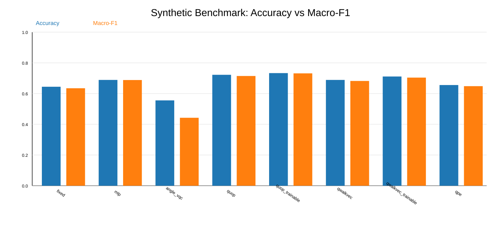
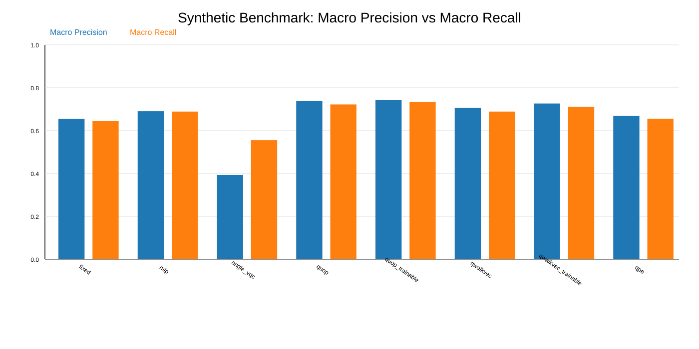
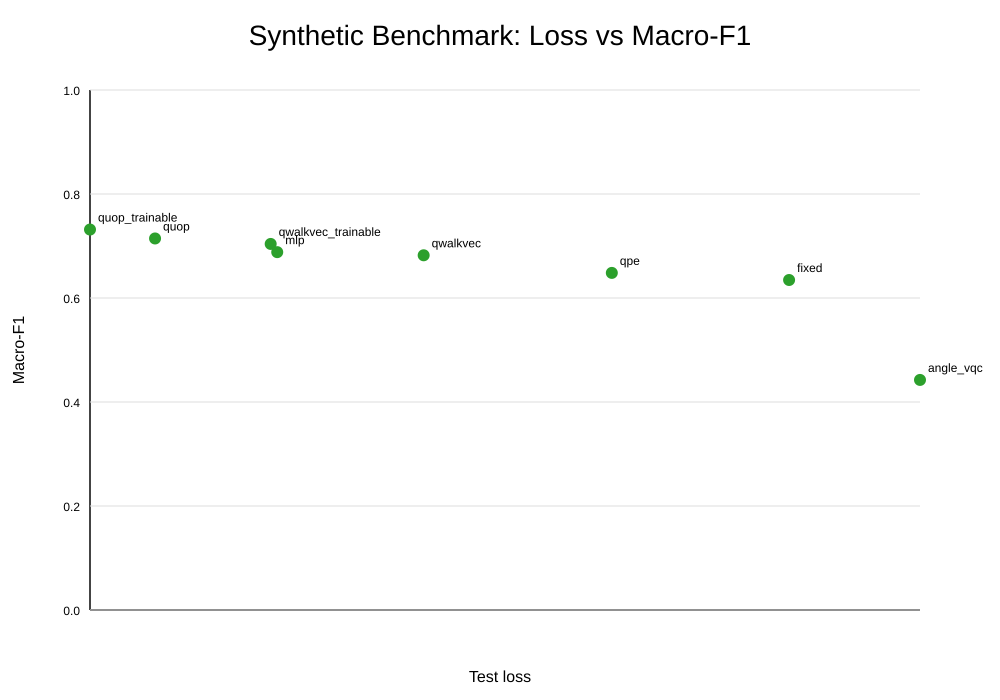

# How Embeddings Shape Graph Neural Networks: Classical vs Quantum-Oriented Node Representations

Implementation scaffold for [How Embeddings Shape Graph Neural Networks: Classical vs Quantum-Oriented Node Representations](https://arxiv.org/abs/2604.15273v1) (Innan et al., 2026).

## Scope

This repository provides a citation-anchored benchmark scaffold that isolates node embedding effects under a fixed GIN classifier and fixed training protocol:

- Classical controls: `fixed`, `mlp`
- Quantum-oriented embeddings: `quop`, `quop_trainable`, `qwalkvec`, `qwalkvec_trainable`, `qpe`
- Interface placeholder: `angle_vqc`

For assumptions and unresolved paper details, see [REPRODUCTION_NOTES.md](REPRODUCTION_NOTES.md).

## Requirements

- Python 3.10+
- pip

Install dependencies:

```bash
pip install -r requirements.txt
```

## Dataset format

Expected file: `{data_dir}/{dataset_name}.pt` (configured in `configs/base.yaml`).

The `.pt` file must contain a Python list of graph dictionaries:

- `adj`: adjacency tensor, shape `(n, n)`
- `label`: integer class id
- `node_features` (optional): tensor, shape `(n, f)`

## Run

```bash
python -m src.train
```

Model checkpoints are written to `best_model.pt`.

## Generate benchmark figures for README

```bash
python -m src.release_benchmark
```

This command writes:

- `results/release_verification/metrics.csv`
- `results/release_verification/metrics_detailed.csv`
- `results/release_verification/accuracy_macro_f1.svg`
- `results/release_verification/precision_recall.svg`
- `results/release_verification/loss_vs_macro_f1.svg`

`metrics.csv` contains mean/std over three seeds; `metrics_detailed.csv` contains per-seed rows and collapse diagnostics (`collapse_flag`, `unique_pred_classes`, prediction-class rates).

These are synthetic-data verification artifacts for end-to-end pipeline validation (not paper table reproduction).

## Latest synthetic benchmark visualizations







| Embedding | Accuracy (mean±std) | Macro-F1 (mean±std) | Loss (mean±std) | Collapse rate |
|---|---:|---:|---:|---:|
| fixed | 0.6444±0.0567 | 0.6346±0.0670 | 0.6462±0.0318 | 0.0000 |
| mlp | 0.6889±0.0157 | 0.6882±0.0163 | 0.5908±0.0178 | 0.0000 |
| angle_vqc | 0.5556±0.0786 | 0.4424±0.1543 | 0.6604±0.0465 | 0.6667 |
| quop | 0.7444±0.0416 | 0.7422±0.0411 | 0.5842±0.0771 | 0.0000 |
| quop_trainable | 0.7000±0.1414 | 0.6429±0.2189 | 0.6152±0.0564 | 0.3333 |
| qwalkvec | 0.6000±0.0720 | 0.5293±0.1386 | 0.6713±0.0308 | 0.3333 |
| qwalkvec_trainable | 0.5000±0.0000 | 0.3333±0.0000 | 0.6932±0.0001 | 1.0000 |
| qpe | 0.5778±0.1100 | 0.4667±0.1886 | 0.6638±0.0419 | 0.6667 |

## Development quality checks

```bash
python -m unittest discover -s tests -p "test_*.py"
```

## Repository structure

```text
configs/         # Experiment configuration
notebooks/       # Walkthrough notebook
src/             # Data, embeddings, model, training, evaluation
tests/           # Release smoke and metric correctness tests
```

## Public release files

- [LICENSE](LICENSE)
- [CONTRIBUTING.md](CONTRIBUTING.md)
- [SECURITY.md](SECURITY.md)
- [CITATION.cff](CITATION.cff)

## Citation

```bibtex
@article{innan2026embeddings,
  title={How Embeddings Shape Graph Neural Networks: Classical vs Quantum-Oriented Node Representations},
  author={Innan, Nouhaila and Rosato, Antonello and Marchisio, Alberto and Shafique, Muhammad},
  journal={arXiv preprint arXiv:2604.15273},
  year={2026}
}
```

